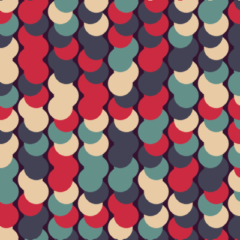

# pixelhouse

A minimalist drawing library for making beautiful animations in python.
Anything that can be drawn can be moved.
_Very much a work in progress!_

      pip install pixelhouse

## Examples (click for source)

## Wishlist / Roadmap

#### Primitives 
+ [x] Line
+ [x] Circle
+ [x] Ellipse
+ [x] Polyline
+ [x] Backgrounds
+ [x] Text
+ [ ] Beizer curves

#### Transforms
+ [x] Rotation
+ [x] Translation
+ [x] Scale
+ [x] Elastic distortions

#### Gradients
+ [x] Linear gradients with transparent elements

#### Layers
+ [x] Blended
+ [x] Additive
+ [x] Subtractive
+ [x] Direct (for primitives)

#### Filters
+ [x] Blur
+ [x] Instagram-style filters (keras not needed)

#### Easing
+ [x] Named easing, Pennser equations
+ [x] Generic beizer easing

#### Color/Palettes
+ [x] Named colors
+ [x] Top palettes

#### File IO
+ [x] Save to gif
+ [x] Save to mp4 
+ [ ] Load from gif
+ [ ] Load from mp4

#### Devops
+ [x] Unified class for artists
+ [x] Hide cv2 weird colorspace, BGR -> RGB
+ [x] Proper library
+ [x] setup.py
+ [x] pip install
+ [x] Context mangager for canvas
+ [ ] Context mangager for animation
+ [ ] Unit tests (started!)
+ [ ] Doc coverage (started!)
+ [ ] Subpixel resolution

## Credits

+ [Travis Hoppe](https://twitter.com/metasemantic?lang=en)

## Projects used 

+ [`opencv`](https://opencv.org/)
+ [Easing functions](https://github.com/semitable/easing-functions)
+ [Bezier curves](https://github.com/reptillicus/Bezier)
