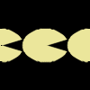

# Quad
A minimalist drawing library for making beautiful animations in python.
_Very much a work in progress!_

## Wishlist / Roadmap

+ Change the background color
+ Text
+ Filters!

+ BGR -> RGB
+ Proper library
+ Subpixel resolution for AA
+ Improve palette library

## Examples

[Example code](generate_demos.py)

## Credits / Code borrowed

+ [Easing functions](https://github.com/semitable/easing-functions)
+ [Bezier curves](https://github.com/reptillicus/Bezier)