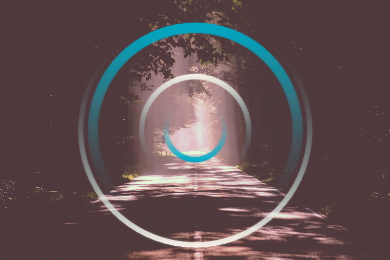
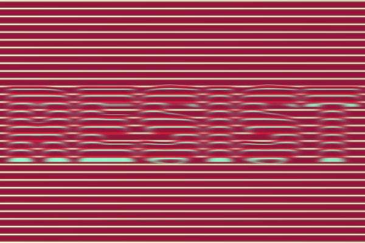
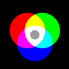
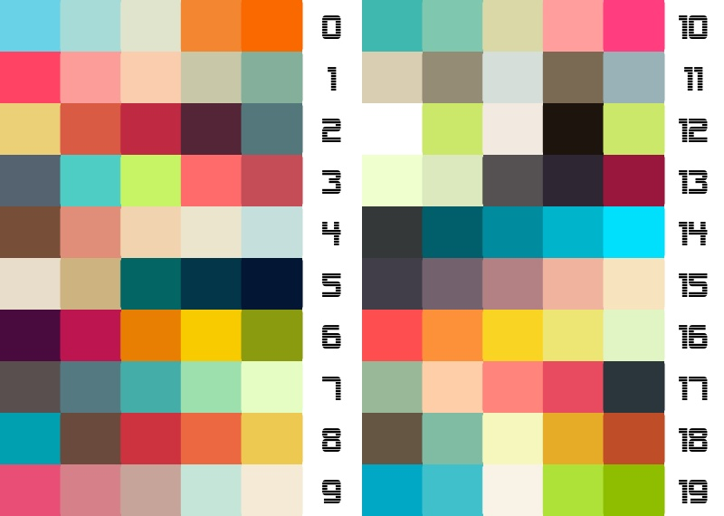

# pixelhouse

[](https://img.shields.io/pypi/pyversions/pixelhouse.svg)
[](https://pypi.python.org/pypi/pixelhouse)

A minimalist drawing library for making beautiful animations in python.
Anything that can be drawn can be moved.  Comes with beautiful gradients, instagram-like filters, and elastic transforms.

_Very much a work in progress!_

    pip install pixelhouse
	  
## Examples (click for source)

[](examples/blue_woods.py)

[](examples/logo_pixelhouse.py)
[](examples/circle_lines.py)

[](examples/resist.py)
[](examples/vapor.py)

[](examples/small_demos.py)
[](examples/small_demos.py)
[](examples/small_demos.py)
[](examples/small_demos.py)
[](examples/small_demos.py)
[](examples/small_demos.py)


_Submit your examples as an issue/pull request or post to twitter under #pixelhouse to have them showcased here!_

Thousands of color palettes are built in, to see a sample of them pass a list:

``` python
import pixelhouse as ph
ph.palette_blocks(range(20)).show()
```

[](examples/show_palettes.py)

## Functionality

+ Primitives: Line, Circle, Ellipse, Polyline, Text*
+ Colors: Named colors, beautiful palettes
+ Gradients: Linear gradients with transparent elements, discrete
+ Animation: Easing (named and custom)
+ Transforms: Rotation, Translation, Scale, Elastic distortions
+ Filters: Blur, [Instagram-style](pixelhouse/filters/insta/gallery.md) filters
+ IO: Save/Load: jpg, png, gif, mp4

\* Note: For advanced font support install [libraqm](https://github.com/HOST-Oman/libraqm) ([why?](https://github.com/thoppe/pixelhouse/issues/26)).

## Press

+ [python weekly](https://mailchi.mp/pythonweekly/python-weekly-issue-374)

## Credits

+ [Travis Hoppe](https://twitter.com/metasemantic?lang=en)

## Projects used 

+ [`opencv`](https://opencv.org/)
+ [Easing functions](https://github.com/semitable/easing-functions)
+ [Bezier curves](https://github.com/reptillicus/Bezier)

